## The Prediction of Credit User's Overdue event Based on Machine Learning Method 

### Project description
* Project 	Source
	* This is a competition project. You can check some details from the official website of this [competition](https://open.chinaums.com/#/intro). Also, you can see my [proposal](./Proposal.md). 
* Project Valuation
	* The competition will select candidate finalists by evaluating **F1 score** on test dataset. If you become one of the candidates, you should submit a document which expains your model. Here is my [document](./document)(about 30 pages).

* Project Requirement(python packages)
	* **missingno** (The missingno library provides a few further useful expressions for a deeper look into this subject. There are some useful method to **visualize the data**)
	* **Impyute** (Impyute is a library of missing data imputation algorithms. Data imputations library to preprocess datasets with missing data. More infomation you can check the website [http://impyute.readthedocs.io/](http://impyute.readthedocs.io/))
	* **imbalanced-learn** (This package aims to process the imbalaned data. There are many methods,including oversapmling and under-sampling)
	* **keras and tensorflow-gpu** (using Deep Neural Network method with GPU)
	* **skicit-learn**
### Data
There are totally 199 input variables which may account for the overdue event.On the whole, They are divided into six categories.

<table>
  <tr>
    <th width=20%, bgcolor=yellow >Categories</th>
    <th width=30%, bgcolor=yellow>Features</th>

  </tr>
  <tr>
    <td> Identity information and property status </td>
    <td> gender, age, house,heath and etc  </td>

  </tr>
  <tr>
    <td>Bank card holding information </td>
    <td> bank level, bank location,bank hoding numbers and etc </td>

  <tr>
    <td>Transaction information </td>
    <td> The last six months' balance,last six months'trading amount and etc</td>
  </tr>

  <tr>
    <td>Lending information </td>
    <td> max/min amount of money in 30/90/180 days,the last amount of money and etc</td>
  </tr>

  <tr>
    <td>Repayment information </td>
    <td> times of sucessed/failed repayment in 30/90/180 days, max/min repayment in 30/90/180 days and etc</td>
  </tr>

  <tr>
    <td> Application for loan information </td>
    <td> numbers for loan in 30/90/180 days, numbers for sucessed/failed loan in 30/90/180 days and etc</td>
  </tr>

</table>

* **Data Structure**
	* Data Matrix
	
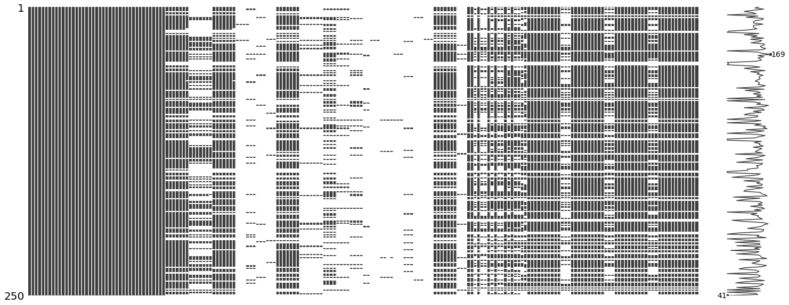

The blank cells are missing data just like the csv file and right figure shows the number of missing data each row.

* Histogram of Missing rate

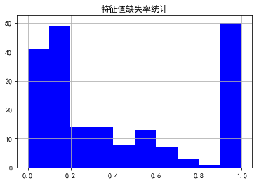

delete the features if the missing rate is greater than **0.4**. After deletion, There are **117 features** survived. 

* Dealing with Missing Data
	* see more details from another jupyter notebook to process the missing data([missing_ data_ process.ipynb](./missing_data_process.ipynb))

* Dealing with the imbalanced label

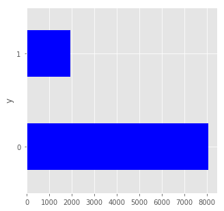

We can see that the data labels are imbalaned. defaulting accounts are around 19% and no-defaulting accounts are 81%

There are many ways we can solve the imbalanced data problem.

	Re-balance the loss weights

Set the loss weights as **{0:0.19,1:0.81}**

	Resampling
* RandomOverSampler
    * Object to over-sample the minority class(es) by picking samples at random with replacement.
* SMOTE
    * SMOTE is an oversampling method. It works by creating synthetic samples from the minor class instead of creating copies. The algorithm selects two or more similar instances (using a distance measure) and perturbing an instance one attribute at a time by a random amount within the difference to the neighboring instances.
    
    Learn more about SMOTE, see the original 2002 paper titled ["SMOTE: Synthetic Minority Over-sampling Technique"](https://jair.org/index.php/jair/article/view/10302).
* ADASYN
    * [Perform over-sampling using Adaptive Synthetic Sampling Approach for Imbalanced Learning](http://140.123.102.14:8080/reportSys/file/paper/manto/manto_6_paper.pdf)

* SMOTETomek
    * Class to perform over-sampling using SMOTE and cleaning using Tomek links.Combine over- and under-sampling using SMOTE and Tomek links.
* SMOTEENN
    * Class to perform over-sampling using SMOTE and cleaning using ENN.Combine over- and under-sampling using SMOTE and Edited Nearest Neighbours.
    
    
You can also check these methods from python [imbalanced-learn](http://contrib.scikit-learn.org/imbalanced-learn/stable/auto_examples/applications/plot_topic_classication.html) package

### Features 
* Feature scaling
	* MinMaxScaler
	* StandardScaler N(0,1)
	* RobustScaler avoid outliers

! X_ test's standardization should use the mean and std of X_train

* Feature selection
	* Too many features may cause overfitting
	* Here we reduce the features by assessing feature importance with **random forests**
	* Also,There are no need to reduce the features for some machine learning method. We can apply other method to control overfitting.eg. dropout for DNN

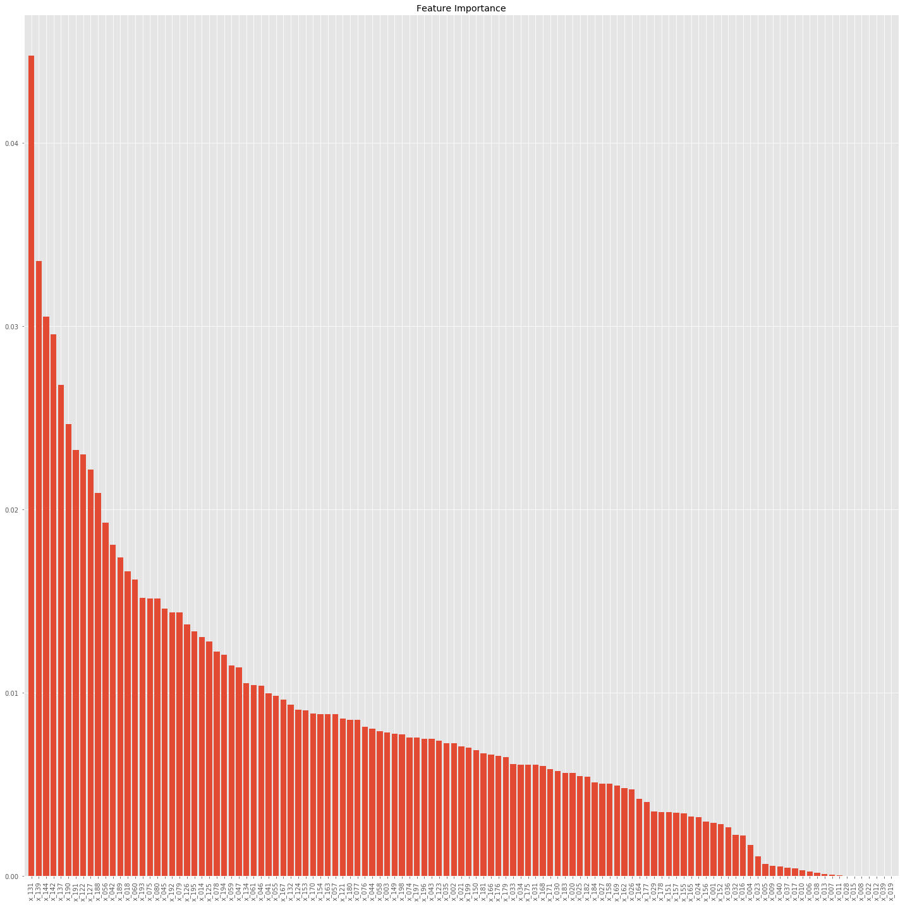

<table>
  <tr>
    <th width=10%, bgcolor=yellow > No.</th>
    <th width=30%, bgcolor=yellow> Features label </th>
	<th width=30%, bgcolor=yellow> Features meaning </th>
	<th width=40%, bgcolor=yellow> Contribution </th>

  </tr>

  <tr>
    <td> 1 </td>
    <td> x_131  </td>
	<td> last amount of money  </td>
	<td> 4.35%  </td>
  </tr>

  <tr>
    <td> 2 </td>
    <td> x_139  </td>
	<td> total amount of money in 90 days  </td>
	<td> 3.15%  </td>
  </tr>

  <tr>
    <td> 3 </td>
    <td> x_144  </td>
	<td> total amount of money in 180 days  </td>
	<td> 3.04%  </td>
  </tr>

  <tr>
    <td> 4 </td>
    <td> x_142  </td>
	<td>number of lending institutions in 180 days  </td>
	<td> 2.59%  </td>
  </tr>

  <tr>
    <td> 5 </td>
    <td> x_190  </td>
	<td> number of loan applied in 30 days  </td>
	<td> 2.55%  </td>
  </tr>

  <tr>
    <td> 6 </td>
    <td> x_189  </td>
	<td> number of loan applied in 30 days  </td>
	<td> 2.40%  </td>
  </tr>

  <tr>
    <td> 7 </td>
    <td> x_137  </td>
	<td> number of lending institutions in 90 days  </td>
	<td> 2.39%  </td>
  </tr>

  <tr>
    <td> 8 </td>
    <td> x_127  </td>
	<td> Financial expenditure  </td>
	<td> 2.32%  </td>
  </tr>

  <tr>
    <td> 9 </td>
    <td> x_056  </td>
	<td> number of traind in other places in 6 months  </td>
	<td> 2.32%  </td>
  </tr>

  <tr>
    <td> 10 </td>
    <td> x_191  </td>
	<td> number of loan applied sucessfully in 30 days  </td>
	<td> 2.09%  </td>
  </tr>

</table>

I will select 50 features accorfing to contributions.

### Methods
* Learner
	* Logistic regression
	* SVM
	* Forest
    	* RandomForestClassifier
    	* GradientBoostingClassifier
	* Deep Neural Network
* Valuation
	* Visualization: Confusion matrices and AUC curves
	* F1 score
		* This value is required by the competition, teams are ranked by F1 score
		* F1 score is sensitive to the threshold of probability, so, here I define a function to select relative best threshold to serve as the threshold to test data
    	* I will select the average threshold which 5 continue f1 score is maximum

### Implementation & Result
* Do pre-processing data,include data imputation, data resampling and features selection
	* [Code](./default-prediction-competition.ipynb)
	* Result
		* Logistic regression (Test F1 score: **0.4504**, Train F1 score: 0.7592)
		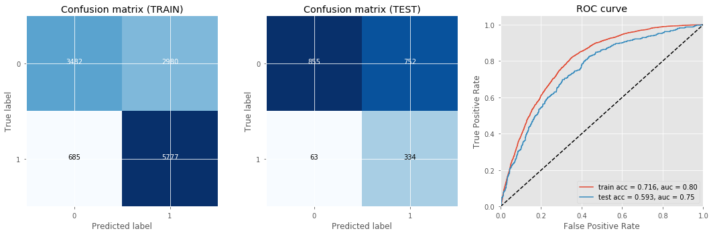

		* SVM (Test F1 score: **0.4150**, Train F1 score: 0.7076)
		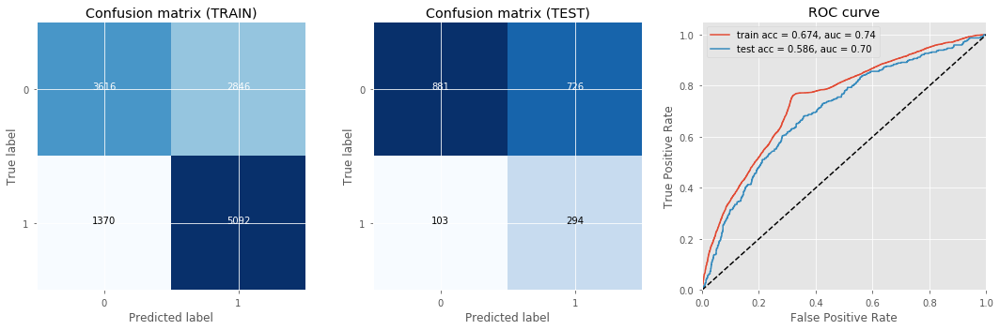
		* Forest
    		* RandomForestClassifier (Test F1 score: **0.4431**, Train F1 score: 0.8698)
    		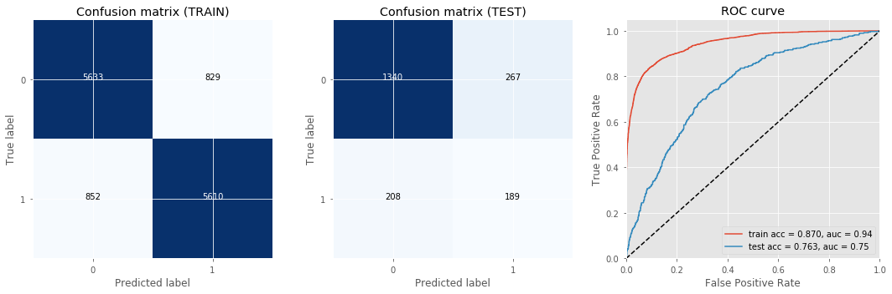
    		* GradientBoostingClassifier (Test F1 score: **0.4069**, Train F1 score: 0.8511)
    		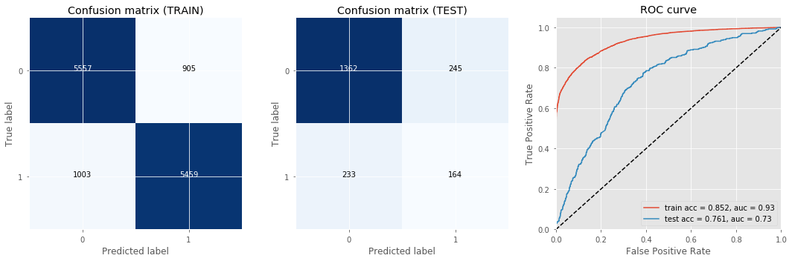
		* Deep Neural Network (Test F1 score: **0.4610**, Train F1 score: 0.6237)
		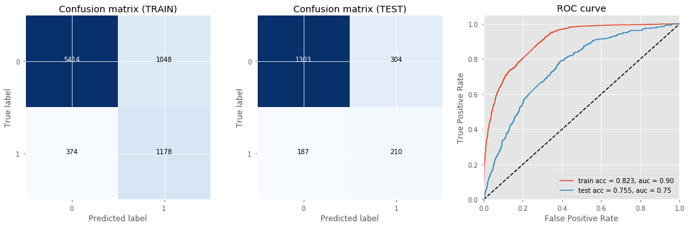

* Do nothing for the raw data but features scaling
	* [Code](./default-prediction-competition_noprocessing.ipynb)
	* Result
		* Logistic regression (Test F1 score: **0.4566**, Train F1 score: 0.4805)
		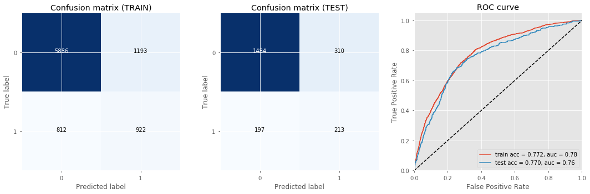

		* SVM (Test F1 score: **0.2898**, Train F1 score: 0.6137)
		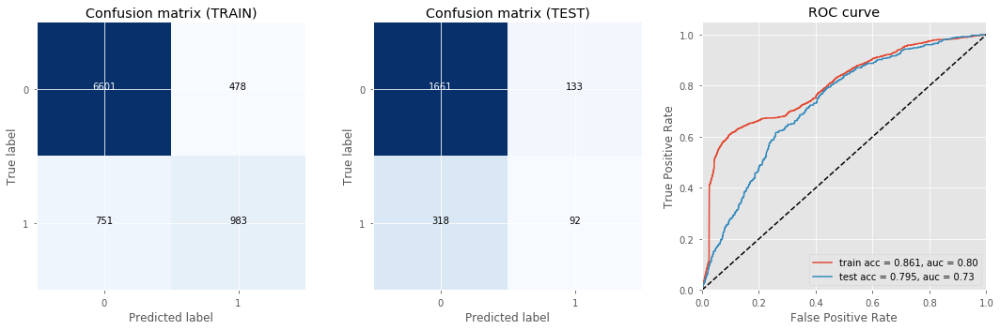 
		* Forest
    		* RandomForestClassifier (Test F1 score: **0.4759**, Train F1 score: 0.6454)
    		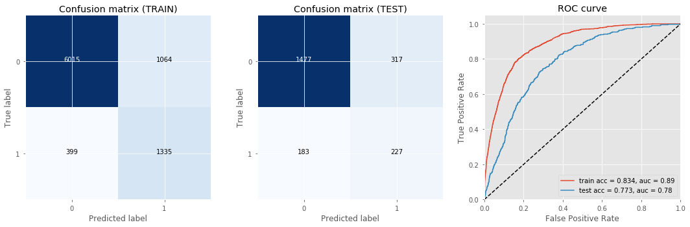
    		* GradientBoostingClassifier (Test F1 score: **0.4592**, Train F1 score: 0.5888)
    		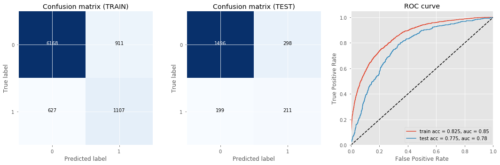
		* Deep Neural Network (Test F1 score: **0.4807**, Train F1 score: 0.6026)
		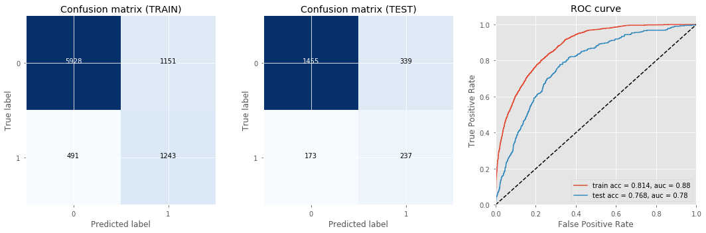

### Conclusion
* **Results and Findings**
	* The models seemed to perform better without the missing values being imputed than when imputing the missing values
	* Feature Engineering improved the F1 score for single models (SVM)
	* The model DNN seems to perform better than other method under the two conditions, however it is better to use GPU.
	* Hyperparameter tuning is a very time consuming process and it is better to train in parallel
	
* **Future Work**
	* Tune the parameters for Deep Learning using Theano / Keras. 
	* Explore the possibility of adding new polynomial and transformed features.
	* Cross Validation is very critical and it is needed to applied on other methods except DNN.
### References
[1]	Lang, W. (2009). Consumer Credit Risk Modeling and the Financial Crisis. International Atlantic Economic Conference.

[2]	Marlin, B. M. (2008). Missing data problems in machine learning. University of Toronto.

[3]	Kitchin, R. (2015). The opportunities, challenges and risks of big data for official statistics. Statistical Journal of the Iaos, 31(3), 471-481.

[4]	孙存一, & 王彩霞. (2015). 机器学习法在信贷风险预测识别中的应用. 中国物价(12), 45-47.

[5]	Lacković, I. D., Kovšca, V., & Vincek, Z. L. (2016). Framework for big data usage in risk management process in banking institutions. Central European Conference on Information and Intelligent Systems, International Conference 2016 / Hunjak, Tihomir ; Kirinić, Valentina ; Konecki, Mario.

[6] Srivastava, N., Hinton, G., Krizhevsky, A., Sutskever, I., & Salakhutdinov, R. (2014). Dropout: a simple way to prevent neural networks from overfitting. Journal of Machine Learning Research, 15(1), 1929-1958.

