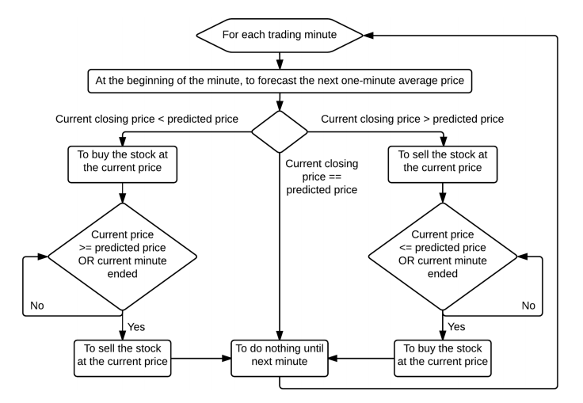

# A Share High-Frequency Trading Strategy Based on Machine Learning Method

----------

## Team members
Tang Jieqiang (Atom)
## Idea
This project aims to implenment a high-frequency strategy based on Machine Learning method, especially,Deep Neural Networks (DNNs). The model was trained on current time (hour and minute),
and n-lagged one-minute pseudo-returns, price standard deviations and trend
indicators in order to forecast the next one-minute average price. The predictions are used to build a high-frequency trading strategy that buys (sells)
when the next predicted average price is above (below) the last closing price

## Features Selection
Current Time, last n pseudo-log-returns, last n
standard deviations of prices and last n trend indicators, where n is the window size.

* **Current Time** 
	* The hour and minute as integer values were chosen as two additional inputs
	* These variables have 6 and 60 possible values ranging from 0 to 5 and
from 0 to 59 respectively.
* **Last n pseudo-log-returns**
	* It is defined as a logarithmic difference (log of quotient) of between average prices on consecutive minutes.
* **Last n standard deviations of prices**
	* The last n one-minute standard deviations of prices are inputs
* **Last n trend indicators**
	* The last n one-minute trend indicators are inputs

## Prediction
The next one-minute pseudo-log-return which also implied hte next average price.

## Data Source
Wind MATLAB & Python API

* one-minute stock data
	* 3311 stocks, from 2016-1-10 to 2017-10-12
	* I may use only 3 or 4 stock's whole data
* ticker data
	* it is needed to caculate one-minute standard deviations of prices & pseudo-log-returns

## Model
* Deep Neural Networks
* SVM
* Desicion Tree
## Strategy Flowchart

## References
[[1] Arévalo, A., Niño, J., Hernández, G., & Sandoval, J. (2016). High-frequency trading strategy based on deep neural networks.](https://link.springer.com/content/pdf/10.1007%2F978-3-319-42297-8_40.pdf)

[[2] Applying Deep Learning to Enhance Momentum Trading Strategies in Stocks
](http://pdfs.semanticscholar.org/5991/fee5265df4466627ebba62e545a242d9e22d.pdf)

[[3] Machine Learning for Market Microstructure and High Frequency Trading](http://www.smallake.kr/wp-content/uploads/2014/01/KearnsNevmyvakaHFTRiskBooks.pdf)
